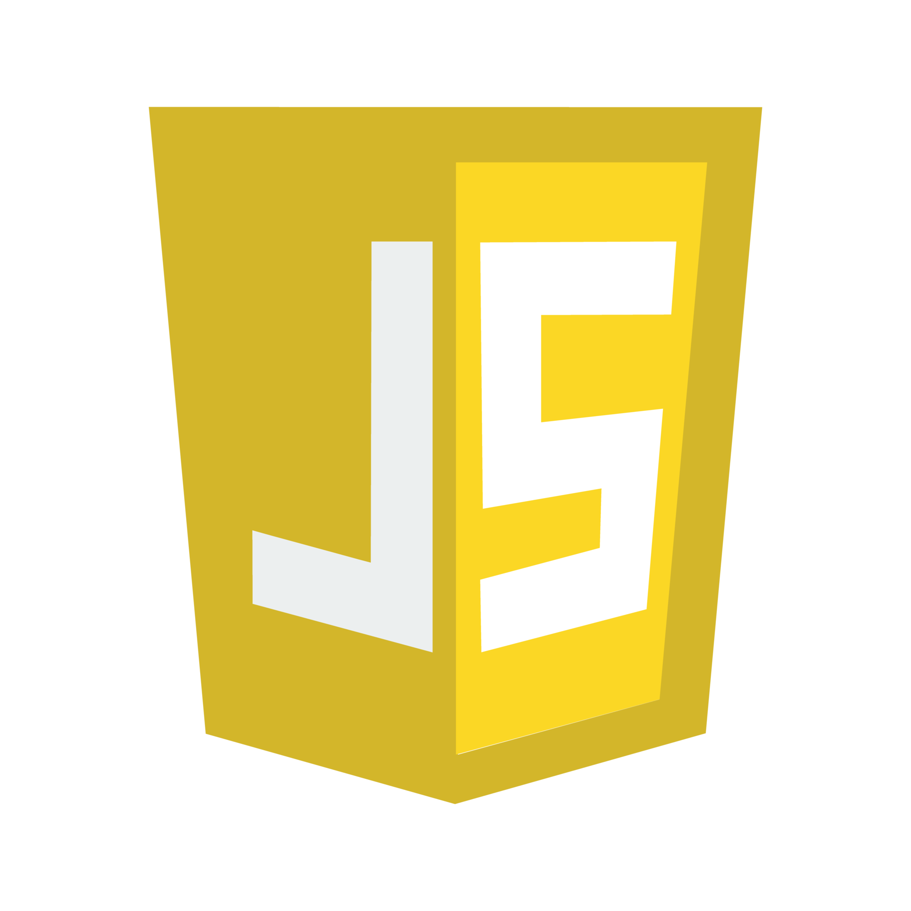

<h1 align="center"> Control de mobiliario Frontend</h1>

## Descripcion

- Aplicacion web creada para personal encargado del prestamo de mobiliario (diseño para movil).
- Proyecto dividido en dos partes, Frontend y Backend. En esta parte veremos los detalles relevantes para el Frontend.
- El backend se encuentra en el siguiente enlace: https://github.com/arcan16/ControlMobiliarioBackend

### Tecnologias utilizadas
---

---

- React
- Redux
- React Router
- HTML5
- CSS
- Java Script

--- 

### Funciones
- Login
- Recuperacion de contraseña
- Panel principal con resumen de pendientes (entregas, reserpciones e inventario)
- Registro, edicion, actualizacion y eliminacion de:
    - Usuarios
    - Empleados
    - Clientes
    - Mobiliario
    - Presentaciones
    - Reservaciones
    - Cobros
- Agenda de reservaciones
- Historial de cobros realizados
- Busqueda de registros  por nombre, codigo o fecha (deacuerdo a los datos que se adaptena a la busqueda)

#### Detalles Login
- Cuenta de administrador por defecto:
    - Usuario: admin
    - Contraseña: admin

## Requerimientos
- Java
- Nodejs
- React
- React Router
- Mysql

### Como utilizar el proyecto en entorno de desarrollo?
1. Clonar backend el repositorio https://github.com/arcan16/ControlMobiliarioBackend
2. Ejecutar usando algun IDE como IntelliJ o Eclipse
3. Clonar frontend en una carpeta distinta https://github.com/arcan16/ControlMobiliarioFrontend
4. Abrir el proyecto en VSCode o similar
5. Para ejecutar proyecto deberas utilizar la terminal de VSC y utilizar el comando 'npm run dev'

### Capturas del proyecto
####  Inicio de sesion + Reservacion

####  Reservaciones activas

####  Realizacion de cobro

####  Registro, modificacion y eliminacion de registros

#### Inventario

####  Recuperacion de contraseña
- Presionamos  "Olvide mi contraseña"

- Escribimos nuestro usuario y/o correo  electronico para recuperar nuestra contraseña

- Recibiremos un enlace en nuestro correo para actualizar la contraseña

- Escribimos la nueva contraseña y Listo!

<h2 align="center">
Buscame en mis redes 

</h2> 
